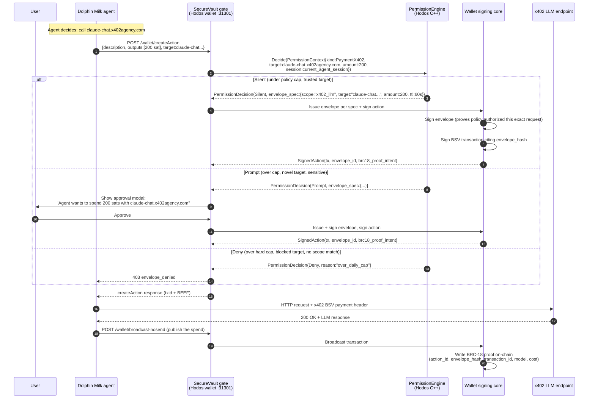

# Architecture (Technical) — Dolphin Milk + Edwin + Hodos

**Audience:** Jake, John, Matt — engineers who already understand BSV, BRC-100, and the basics of each project. Not the pitch audience.
**Status:** v1, drafted 2026-05-29. Will iterate after Jake meeting.
**Purpose:** Lock the process layout, request flow, trust boundaries, and the PermissionEngine-as-envelope-issuer synthesis.

---

## 1. The three-party system (high level)

```
┌────────────────────────────────────────────────────────────────────┐
│                          USER'S MACHINE                            │
│                                                                    │
│  ┌──────────────────────────────────────────────────────────────┐  │
│  │                       HODOS BROWSER (CEF)                    │  │
│  │                                                              │  │
│  │  ┌────────────┐    ┌──────────────┐    ┌─────────────────┐   │  │
│  │  │ Browser    │    │ Agent UI     │    │ Wallet panel    │   │  │
│  │  │ tabs       │    │ overlay      │    │ overlay         │   │  │
│  │  └────────────┘    └──────────────┘    └─────────────────┘   │  │
│  │         │                  │                    │            │  │
│  │         └──────────────────┼────────────────────┘            │  │
│  │                            │                                 │  │
│  │                ┌───────────▼────────────┐                    │  │
│  │                │  Hodos C++ shell       │                    │  │
│  │                │  (HTTP interception,   │                    │  │
│  │                │   IPC routing,         │                    │  │
│  │                │   subprocess mgmt)     │                    │  │
│  │                └────┬──────┬──────┬─────┘                    │  │
│  │                     │      │      │                          │  │
│  └─────────────────────┼──────┼──────┼──────────────────────────┘  │
│                        │      │      │                             │
│  ┌─────────────────────▼┐   ┌─▼────┐ │  ┌────────────────────────┐ │
│  │ Hodos BRC-100 wallet │   │ad-   │ │  │ Dolphin Milk agent     │ │
│  │ (Rust, port 31301)   │   │block │ │  │ (Rust, port 8080)      │ │
│  │ EXISTING             │   │engine│ │  │ NEW — bundled subproc  │ │
│  │ + Edwin envelope     │   │      │ │  │                        │ │
│  │   issuance           │   │      │ │  │  Web UI on /ui/        │ │
│  │ + PermissionEngine   │   │      │ │  │  HTTP API on other     │ │
│  │   (already exists,   │   │      │ │  │   paths                │ │
│  │   extended to know   │   │      │ │  └────────────────────────┘ │
│  │   about envelopes)   │   │      │ │            ▲                │
│  └──────────────────────┘   └──────┘ │            │ wallet HTTP    │
│           ▲                          │            │ calls via      │
│           │                          │            │ HodosBrowser   │
│           │ envelope-gated requests  │            │ shim or local  │
│           └──────────────────────────┘            │                │
│                                                   │                │
└───────────────────────────────────────────────────┼────────────────┘
                                                    │
                                                    │ x402 micropayments
                                                    ▼
                                  Open marketplace of LLMs + tools
                                  (Claude, GPT, Whisper, Veo,
                                  image, transcription, X-search,
                                  etc. — anything BRC-29 + x402)
```

**Three subprocesses managed by Hodos's C++ shell:**
1. Hodos BRC-100 wallet (EXISTING, port 31301)
2. Adblock engine (EXISTING, port 31302)
3. Dolphin Milk agent (NEW, port 8080)

This follows the pattern already in use. Adding the third managed subprocess is incremental, not novel.

---

## 2. Process layout — what changes, what stays

### EXISTING — reused, possibly extended

| Component | Today | Change |
|---|---|---|
| Hodos C++ shell (CEF) | Manages 2 subprocesses (wallet + adblock); overlay system; HTTP interception | Manages 3 subprocesses (add agent); new "Agent overlay"; new omnibox keyword (`agent:`) |
| Hodos Rust wallet (`:31301`) | 89+ BRC-100 handlers, signing, payments, BRC-31 auth, BRC-72 linkage, BRC-29 PeerPay, BRC-121 paid content | Apply 3 small Canary A1 patches; add envelope issuance endpoints; add envelope-verification logic in signing path |
| Hodos `PermissionEngine` (C++) | Matrix C: domain trust → privacy perimeter → scoped grants → payment caps → cert disclosure → generic. Returns Silent / Prompt / Deny | Extended to also return an envelope-spec when decision is Silent or Prompt-then-approved. Same logic, additional output. |
| Hodos wallet panel overlay | Shows transactions, balance, send/receive | New "Agent activity" view rendering BRC-18 OP_RETURN proofs as friendly entries |
| Payment-success-IPC chain | Tab badge animation on every paid request (load-bearing UX safeguard) | Extended to fire on agent-paid x402 calls (NOT removed, NOT changed in shape) |
| Hodos installer | Signs + bundles wallet + adblock binaries | Adds `dolphin-milk` binary, signed alongside |

### NEW — to be built

| Component | What it does | Owned by |
|---|---|---|
| Dolphin Milk subprocess wrapper | Spawn/health-check/restart/kill `dolphin-milk` binary; capture logs; manage data dir | Hodos (C++) |
| Agent overlay | CEF subprocess rendering Dolphin Milk's `/ui/` (v1) or a Hodos-native UI calling Dolphin Milk's HTTP API (v2) | Hodos (frontend) |
| Wallet endpoint shims (3 patches) | `listOutputs` accept `basket: "default"`; 4 GET routes for status endpoints; `internalizeAction` response shape | Hodos (Rust) |
| Envelope issuance + verification in wallet | New endpoints: `POST /envelope/issue`, `POST /envelope/verify`. Signing path checks for valid envelope before signing privileged actions. | Hodos (Rust, designed with Jake) |
| PermissionEngine extension for envelope spec | When `Decide()` returns Silent/Prompt-approved, additionally produce `EnvelopeSpec{scope, target, payload_hash, ttl}` for the wallet to sign | Hodos (C++) |
| Envelope-aware fee split | If transaction was authorized via envelope from Edwin gate, route fee portion to Edwin treasury | Hodos (Rust) — pending monetization terms |
| Agent settings overlay | Configure BYO API keys, default model, budget caps, scope policies | Hodos (frontend) |

### NEW — possibly upstream contribution

| Component | What it does | Owned by |
|---|---|---|
| Dolphin Milk patches (if needed) | If Hodos wallet shape differs from `bsv-wallet-cli` in subtle ways the canary missed, may need Dolphin Milk to accept config for "non-canonical-but-spec-compatible" wallet responses | John (upstream PR) or Hodos (fork until merged) |
| Edwin SecureVault library extraction | If Edwin currently bundles vault + multi-channel inbox + Tauri desktop, the vault primitives may need to be extracted as a standalone library for Hodos to link | Jake (decision point in meeting) |

---

## 3. The request flow — annotated sequence

The central design question Matt surfaced: *what happens when the agent wants to make an x402 LLM call, and do we prompt the user every time?*



**Key properties of this flow:**

- **The envelope is always present.** Whether auto-issued (Silent) or user-issued (Prompt-approved), every signed action has an envelope. There is no signing path that bypasses envelopes.
- **The envelope is always action-specific.** Even auto-issued envelopes bind the scope, target, payload-hash, and amount. A pre-authorized policy doesn't produce a blank-check envelope — it produces a narrowly-scoped one per request.
- **The envelope's role is dual:** (a) cryptographic gate that the wallet checks before signing; (b) audit artifact that the BRC-18 proof references, so the on-chain receipt links *action → envelope → policy*.
- **Prompt frequency is policy-driven.** A user who sets *"auto-approve up to $0.50/day on x402 LLM endpoints"* sees zero prompts for normal use. A user who sets *"prompt me for every action"* sees a prompt per call. Both are valid; the user picks.
- **Prompt-injection survival.** A malicious page that injects *"send 200K sats to bc1qattacker"* into the agent triggers a PermissionEngine lookup for `target:bc1qattacker, amount:200K`. No policy matches → Prompt → user sees real ask → declines. No silent attack path.

---

## 4. The PermissionEngine + envelope synthesis (the architectural call)

This is the central design decision. Matt named it; the canary made it possible; here it is laid out.

### The principle
> **PermissionEngine is the decision logic. The envelope is the cryptographic artifact that proves the decision happened.** They are two faces of the same gate.

### Why this works
- Hodos already has the decision logic. PermissionEngine implements Matrix C with priority order and is unit-tested (25 tests per `PermissionEngine.cpp`).
- Edwin already has the cryptographic primitive. The signed-envelope spec is well-defined and the SecureVault API boundary already exists in Edwin's code.
- Neither side has to build the other's piece. The integration is a join — PermissionEngine's decision drives envelope issuance.

### What changes for PermissionEngine
- `Decide()` signature gets an additional output: `Optional<EnvelopeSpec>`.
- For `Silent` decisions: `EnvelopeSpec` is populated with the scope/target/payload-hash/ttl derived from the matching policy + request.
- For `Prompt` decisions (post-approval): `EnvelopeSpec` is populated and a user-signature is captured.
- For `Deny` decisions: no envelope.
- Existing tests still pass — the new output is additive.

### What changes for the wallet
- New `/envelope/issue` and `/envelope/verify` endpoints.
- The signing path (`createAction`, `internalizeAction`, anything that signs) verifies envelope before signing.
- Backward compat: pre-existing wallet callers without envelopes still work IF their action is initiated from a non-agent context (user click in wallet panel). Mechanism: a "user_action_context" flag in the wallet's internal call graph distinguishes agent vs. user paths.

### What stays in Edwin's domain (and is sourced from Jake)
- The envelope schema (`{kid, alg, iat, exp, nonce, scope, target, payload, sig}`).
- The signature algorithm (secp256k1 ECDSA).
- The TTL semantics + nonce-replay guard.
- BRC-42 sub-key derivation for per-device sub-identities (the multi-device story).

---

## 5. Should envelope gating apply to ALL wallet actions, or only AI-agent actions?

Matt's question. Three options:

| Option | Scope | Pros | Cons | Recommendation |
|---|---|---|---|---|
| A. Agent-only | Edwin envelope required only for agent-initiated wallet calls. User-clicks-in-wallet-panel bypasses. | Smaller surface to change. User-action flow is unchanged. | Doesn't protect against malicious dApp pages that trick the user into clicking "send" with spoofed values. | Acceptable v1. |
| B. All wallet actions | Every signing op requires an envelope, including user clicks. | Strongest security uniformly. Unlocks features like time-delayed actions, multi-sig, full on-chain receipts. | Larger refactor. Existing UI flows need envelope-issuance integration. Existing dApps may break until they migrate. | Better long-term, riskier short-term. |
| C. Agent envelope-gated, user envelope-implicit | Agent path: explicit Edwin envelope. User path: the user's click IS the implicit envelope (PermissionEngine still gates the click). | Cleanest separation. Existing dApp surface unchanged. Strongest gain where most needed. | Two slightly different signing paths internally. | **RECOMMENDED for v1.** Path to Option B exists as a later upgrade. |

**Recommendation: ship Option C for the PoC and pitch. Reserve Option B as a roadmap item.**

The agent surface is where prompt injection is the live threat. The user-click surface has a human-in-the-loop already; the marginal security from envelope-gating is real but not the same urgency. Ship the high-leverage gate first.

---

## 6. Trust boundaries (the threat model)

What trusts what, what can be compromised without losing the system.

```
TRUST LEVEL 0 — adversarial
─────────────────────────────────
  Anything on the public internet:
    - Web pages the agent reads
    - x402 endpoints serving the agent
    - Tools the agent invokes
  
  Assumption: any of these can attempt prompt injection,
  return malicious payloads, or attempt to drain the wallet.

TRUST LEVEL 1 — semi-trusted (sandboxed)
─────────────────────────────────────────
  Dolphin Milk agent runtime:
    - May be tricked by prompt injection
    - Has its own process, no key access
    - Can request actions but cannot execute them
    - Limited to BRC-52 capability cert scope
  
  Assumption: the agent will sometimes be wrong.
  System design must survive that.

TRUST LEVEL 2 — trusted infrastructure
───────────────────────────────────────
  Edwin SecureVault layer (in Hodos wallet):
  Hodos PermissionEngine:
    - Pure logic, deterministic, unit-tested
    - No LLM, no remote code
    - Refuses to sign without valid envelope
  
  Assumption: code-review and test coverage make this layer
  trustworthy. Compromise here = compromise of the system.

TRUST LEVEL 3 — the user
─────────────────────────
  The user's wallet master key:
  The user's click on approve/decline:
    - The cryptographic anchor of all authority
  
  Assumption: keys are in OS keychain or behind 2FA.
  User-click is the irreducible authorization.
```

**Defense-in-depth chain:**
1. **Web page can't talk to wallet directly.** Hodos's CEF interception forces wallet calls through HTTP, which goes through PermissionEngine.
2. **Agent can't sign.** Agent has no signing key; can only submit envelope-bearing requests.
3. **PermissionEngine catches policy violations.** Out-of-scope, over-cap, novel target → Prompt or Deny.
4. **SecureVault catches forged/replayed envelopes.** Bad sig, expired, replayed nonce → reject.
5. **Wallet refuses to sign without valid envelope.** Last-line gate.
6. **Budget caps catch escape.** If somehow a malicious envelope passes (e.g., user mis-clicks), per-task / daily / weekly caps limit damage.
7. **BRC-18 proof on-chain.** Even if damage occurs, the receipt is verifiable forensically.

This is BOTH defense-by-impossibility AND defense-in-depth. The impossibility layer is the cryptographic refusal point; the depth catches everything else.

---

## 7. BRC standards used (with role)

| BRC | Who uses it | Role |
|---|---|---|
| BRC-29 | Dolphin Milk | x402 payment construction (P2PKH outputs sent in `x-bsv-payment` header) |
| BRC-31 | Dolphin Milk ↔ Hodos wallet, Dolphin Milk ↔ x402 endpoints | Mutual auth via signed nonces |
| BRC-42 | All three | Hierarchical key derivation. Hodos wallet derives child keys; Edwin derives per-device sub-identities |
| BRC-52 | Dolphin Milk | Capability certificates limiting agent tool categories |
| BRC-100 | Dolphin Milk ↔ Hodos wallet | The 28-endpoint wallet API; verified compatible per Canary A1 |
| BRC-18 | Dolphin Milk | On-chain hash-chained proof of every agent decision (OP_RETURN) |
| BRC-92/107/108/115 | Edwin | Token / identity / verification primitives Edwin uses for per-interaction binding |
| Edwin envelope (no BRC#) | Edwin (proposing to merge) | Signed authorization envelope — could be proposed as a new BRC once stable |

---

## 8. Cross-platform considerations

Per Hodos CLAUDE.md invariant 9: *"All new C++ code must use `#ifdef _WIN32` / `#elif defined(__APPLE__)` platform conditionals."*

| Surface | Windows | macOS | Linux |
|---|---|---|---|
| Dolphin Milk binary | `dolphin-milk.exe`, Authenticode-signed | `dolphin-milk`, notarized + signed | Deferred (per `LINUX_BUILD.md`) |
| Subprocess management | Existing pattern in `cef_browser_shell.cpp` | Existing pattern in `cef_browser_shell_mac.mm` | n/a v1 |
| Agent overlay creation | Existing CEF overlay pattern | Existing NSPanel overlay pattern + `NSWindowDelegate` | n/a v1 |
| Envelope storage at rest | Existing wallet DB at `%APPDATA%/HodosBrowser/Default/` | `~/Library/Application Support/HodosBrowser/` | n/a v1 |
| Key custody | Windows Credential Manager via `crypto/dpapi.rs` | macOS Keychain (already stubbed in `crypto/dpapi.rs`) | n/a v1 |

No Mac-specific *new* work for the envelope system itself — it rides on the existing wallet's platform abstraction.

---

## 9. Open design questions for Jake (the meeting agenda)

These are the engineering decisions the partner conversation has to resolve.

1. **SecureVault library extraction.** Edwin currently bundles vault + multi-channel inbox + Tauri desktop. For Hodos to link the vault primitives, do we (a) extract a `edwin-vault` crate that both Edwin and Hodos depend on, or (b) reimplement the vault interface in Rust for Hodos using Edwin's schema as spec? Jake's pick.

2. **Envelope schema standardization.** If Edwin envelopes become a primitive used by Hodos (and possibly other BRC-100 wallets), do we propose a BRC for them? Timing — submit during/after pitch?

3. **Multi-channel inbox in scope?** Edwin's WhatsApp/Telegram/Discord/Signal/iMessage surface is a separate product feature. For the PoC, do we ship only the security primitives, or do we wire one channel through Hodos as a demo (e.g., "your agent texted you when the task completed")?

4. **TTL vs long-running task.** Default envelope TTL is 30-60s. A long-running agent task (multi-step research) may need to chain signatures over minutes. Options: per-step re-envelope (more crypto, more prompts under naive policies) vs. session envelope with refresh-token semantics (one signature + auto-refresh until expiry).

5. **Edwin's BRC-42 device tree.** If Hodos becomes a "device" in the Edwin sub-identity tree, does Hodos's wallet master key become a sub-identity of the user's Edwin master, or do they share custody at the same level? This affects backup/recovery.

6. **Refactor state.** Edwin's local checkout shows recent commits removing lancedb, switching to qmd backend, disabling web UI/canvas by default, pruning extensions. Jake is mid-refactor. What's the stable surface we should target — 2026.2.3 (current shipped) or main (post-refactor)?

7. **Monetization.** Per Matt's proposal: portion of Hodos's existing 1000-sat service fee on Edwin-envelope-gated transactions routes to Edwin treasury. What's the split? (Matt's instinct: 60/40 Hodos/Edwin on agent-authorized transactions. Open to Jake's counterproposal.)

---

## 10. Open design questions for John (parallel partner conversation)

1. **Wallet URL override + endpoint shim.** Confirmed Hodos-side via Canary A1. Three small patches on our side. Any Dolphin Milk-side changes needed? (Lean: no — Dolphin Milk's client is already flexible.)

2. **BRC-18 receipt schema.** Want to add an `envelope_hash` field to the on-chain proof so the receipt cryptographically links the action to the policy that authorized it. Upstream contribution or Hodos-side annotation?

3. **Bundled-binary distribution.** Apache 2.0 means we can bundle freely, but coordinating versions matters. Quarterly cadence on Dolphin Milk releases that Hodos pulls into the installer?

4. **x402 marketplace alignment.** Dolphin Milk's bundled LLM routes go through `x402agency.com`. Do we expose user-configurable endpoint URLs (so a user could route through their own x402 provider), or hardcode for v1?

---

## 11. What this doc is NOT

- Not a process spec (no port numbers above 31301/31302/8080 are committed; subject to change)
- Not a UI spec (overlay layouts, omnibox keyword, settings shape — covered separately)
- Not a marketing pitch (see `ARCHITECTURE_PITCH.md` once written, and `PRODUCT_OUTLINE_v1.md`)
- Not a security audit (assumed but not proven; Hodos's hunter-skeptic-referee process applies before any shipping commit)

---

## Related

- `PRODUCT_OUTLINE_v1.md` — overall product framing + marketing wedges
- `PITCH_EVENT.md` — AWS competition forcing function
- `EDWIN_VS_DOLPHIN_MILK_SECURITY.md` — the security model comparison this doc builds on
- `CANARY_A1_WALLET_COMPAT.md` — wallet API compatibility check
- `JAKE_OUTREACH_DM.md` (marketing) — partner outreach message
- Hodos `CLAUDE.md` — invariants and surface area
- `cef-native/src/core/PermissionEngine.cpp` — the engine being extended
- `rust-wallet/src/handlers.rs` — wallet endpoint surface (89+ handlers)
